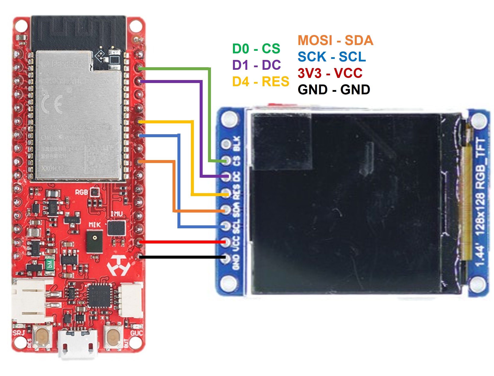

# IMU-TFTLCD-GRAPH

## Proje Senaryosu 
Deneyap Kartta dahili 6-Eksen Ataletsel Ölçüm Birimi (IMU)dan alınan dönme eksen açılarını Roll, Pitch, Yaw değerlerini okumaktadır.Okunan sensör verilerini TFTLCD ekranında grafiksel olarak göstermektedir.

## Projede Kullanılan Ürünler
- **[1 Deneyap Geliştirme Kartı](https://docs.deneyapkart.org/tr/content/contentDetail/deneyap-kart)**
- **1 TFTLCD Ekran**
- **1 Breadboard**
- **7 Erkek-Erkek Jumper Kablosu**

## Proje Bağlantısı 

## Projede Kullanılan Kütüphaneler 
[Adafruit ST7735 and ST7789 Library by Adafruit](https://github.com/adafruit/Adafruit-ST7735-Library)

## Proje Videosu
