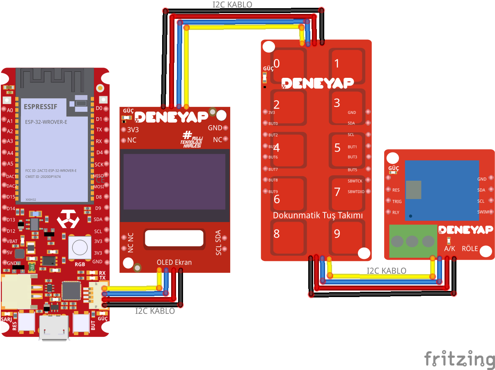

# Kapı Kolu Sistemi

## Proje Senaryosu 
4 haneli rakam girilerek şifre belirlenir. Kullanıcı Deneyap Oled ekranında "sifre giriniz" yazısını gözlemleyecektir.  Deneyap Tuş Takkımı her girdiği şifre karakterinde Deneyap Oled ekranda * karakteri yazılacaktır.
4 haneli doğru şifreyi girdiğinde Deneyap Oled ekranda "sifre dogru" yazacaktır, Deneyap Röle açılacaktır, Dahili adreslenebilir RGB ledi olan Deneyap Geliştrme Kartın ledi yeşil yanacaktır. Bu süreç 2 saniye sürecektir.
2 saniyeden sonra led sönecek Deneyap Röle kapanacak ve tekrar şifre girilmesi istenecektir.
Şifre yanlış girildiğinde Deneyap Oled ekranda "sifre yanlis" yazacaktır. Dahili adreslenebilir RGB ledi olan Deneyap Geliştrme Kartın ledi kırmızı yanacaktır. Bu süreç 2 saniye sürecektir. 
Deneyap Dokunmatik Tuş Takımında basma süresine bağlı olarak birden fazla okuma yapabilir.

## Projede Kullanılan Ürünler
- **[1 Deneyap Geliştirme Kartı](https://docs.deneyapkart.org/tr/content/contentDetail/deneyap-kart)**
- **[1 Deneyap Dokunmatik Tuş Takımı](https://docs.deneyapkart.org/tr/content/contentDetail/deneyap-modul-deneyap-dokunmatik-tus-takm-m37)**
- **[1 Deneyap OLED Ekran](https://docs.deneyapkart.org/tr/content/contentDetail/deneyap-modul-deneyap-oled-ekran-m09)**
- **[1 Deneyap Röle modülü](https://docs.deneyapkart.org/tr/content/contentDetail/deneyap-modul-deneyap-role-m36)** kullanılmıştır.

## Proje Bağlantısı 
Bu çizimde Deneyap Kart 1A kullanılmıştır. Bu projede diğer Deneyap Geliştirme Kartlarından biri kullanılabilir. 

## Projede Kullanılan Kütüphaneler 
[Deneyap Dokunmatik Tuş Takımı by Turkish Technnology Team Foundation (T3)](https://github.com/deneyapkart/deneyap-dokunmatik-tus-takimi-arduino-library)

[Deneyap Röle by Turkish Technnology Team Foundation (T3)](https://github.com/deneyapkart/deneyap-role-arduino-library)

[Deneyap OLED by Turkish Technnology Team Foundation (T3)](https://github.com/deneyapkart/deneyap-oled-ekran-arduino-library)

## Proje Fotoğrafları ve Videosu

KapiKoluSistemi2.mp4

